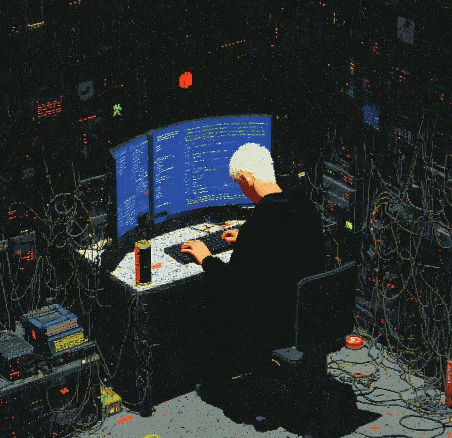

<table>
  <tr>
    <td>
<pre>
###################******###%%############
############*=-:.:....    .==+##%#########
#########+=:...:==-==:::--:=::::+#%#######
######*-..:--=+*+*#%#@@%%%%%%%#=..*%######
#####:    .::-+*=..=%@@@%@%@@@@%*:.*######
####.           ..  -%@@%###%@%%%#==*#####
###-       ....      :--+=-..-=*%*--:+%###
##*         .. ....   -- :=-.. -+***: *%##
##=            ..   .. .    -:    :-=.:###
##=        ..   -:..          :=-...-= *##
##+ .::..  .--. :-:..  .  .     .--  : +#
##*          :-----..:  ..  : .   :-.. =#
###:           .:---. .   ..-=--..   ..+#
###*.            .---.     ..-=::-..   *#
#####=:.           :--.      .   -:::..##
#######*+:          .:::       .   .. -%#
#########+-       .  ..::.            *##
########-             ... ...       .:###
#######*                     .==----=*###
#######:                    .###%%%%%####
######=                     =############
###*=.                      +############
*=.                         =############
                             :+##########
                               -#########

</table>

<!-- Profile image added below -->

 

